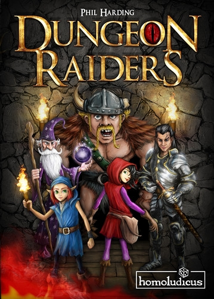
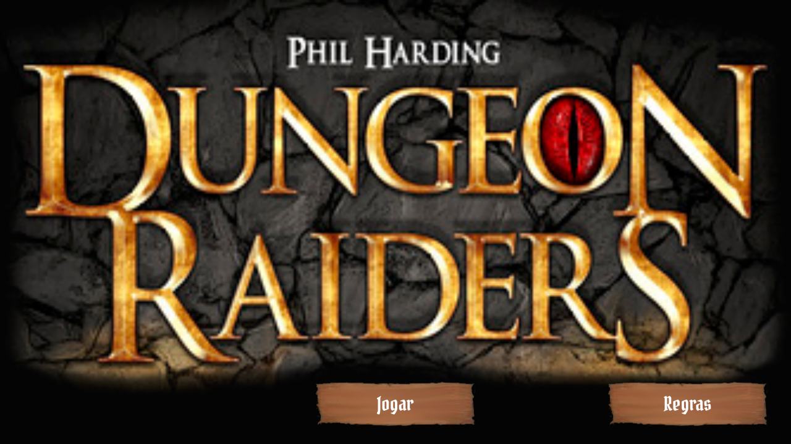
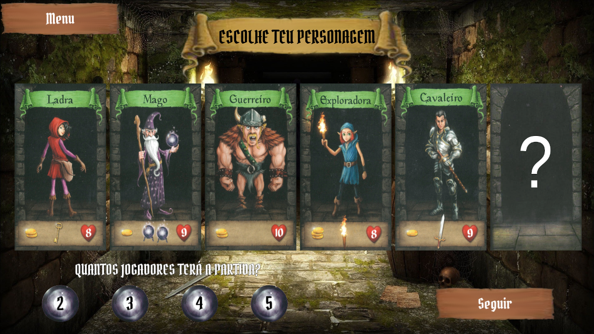
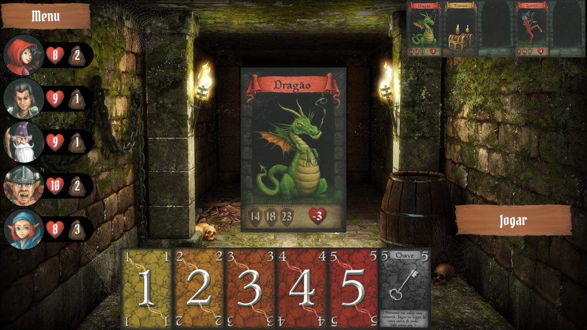

# Dungeon-Raiders-Phaser
Jogo baseado na primeira edição do jogo Dungeon Raiders de Phill Harding, feito utilizando Phaser 3.  
https://www.ludopedia.com.br/jogo/dungeon-raiders
https://boardgamegeek.com/boardgame/80771/dungeon-raiders

[CLICA AQUI PARA JOGAR](https://loukis-13.github.io/Dungeon-Raiders-Phaser/)

 

## capturas de tela
 
 
 